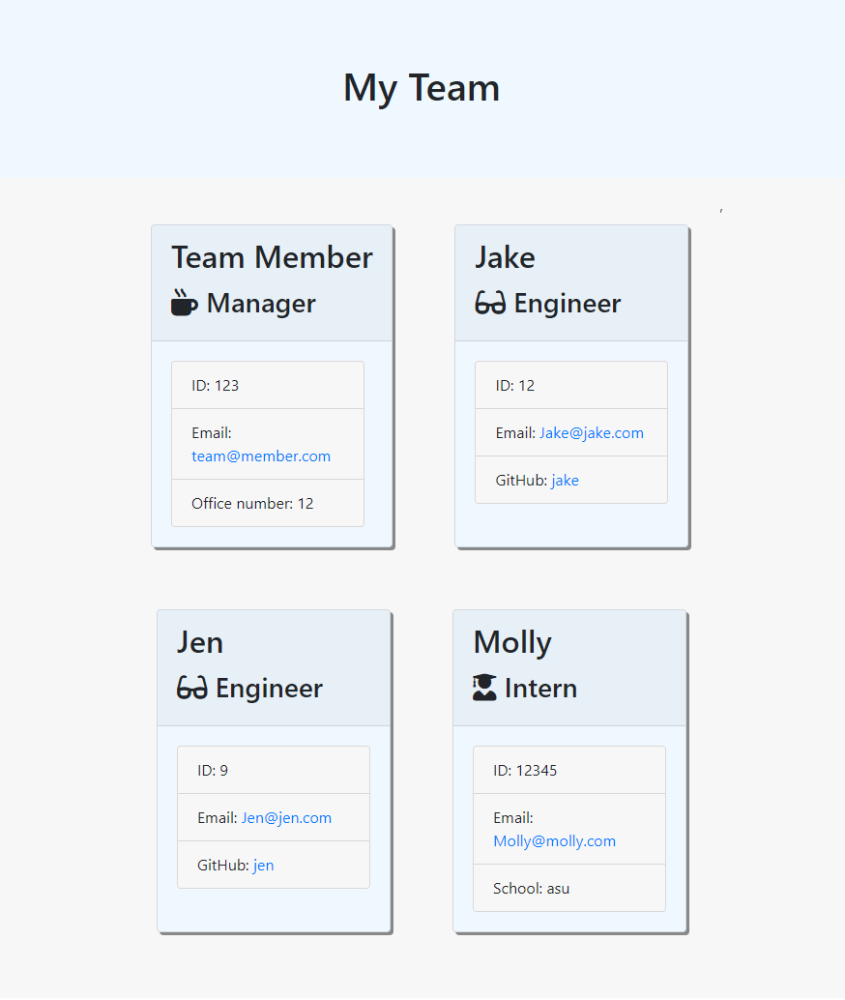

# Employee-Template-Engine
  
## Testing
  

  
---
  
## Description 
An app for development teams to create a webpage with profiles for all of the members of your team, with roles and contact info.
[GitHub Repository](https://github.com/markmckenna37/Employee-Template-Engine)
                      
--- 
                      
## Table of Contents
                      
                      
* [Installation](#installation)
* [Usage](#usage)
* [Contributing](#contributing)
* [License](#license)
* [Questions](#questions)
                      
---
                      
## Installation
                      
Just clone the prokject repo into a local directory. You will also need Node.js installed to use this project. Once inside your cloned directory, enter "npm i" to install the required packages"
                      
                      
---
                      
## Usage 
                      
Simply enter "node app.js" into your gitbash/terminal, and respond to the proceeding prompts! Your rendered profile will be in the "output" directory.
                      
---
                      
## Contributing
                      
Mark McKenna
                      
---
                      
## License
                      
This project is licensed under MIT.
  
Copyright (c) [2020] [Mark McKenna]
  
                      
---
                                                         
## Questions
Have any questions or contributions? Check out my [GitHub Profile](https://github.com/markmckenna37)                 
Or you can email me at <Markmckenna37@gmail.com>.
                      
---
                      
## Tests
                      

